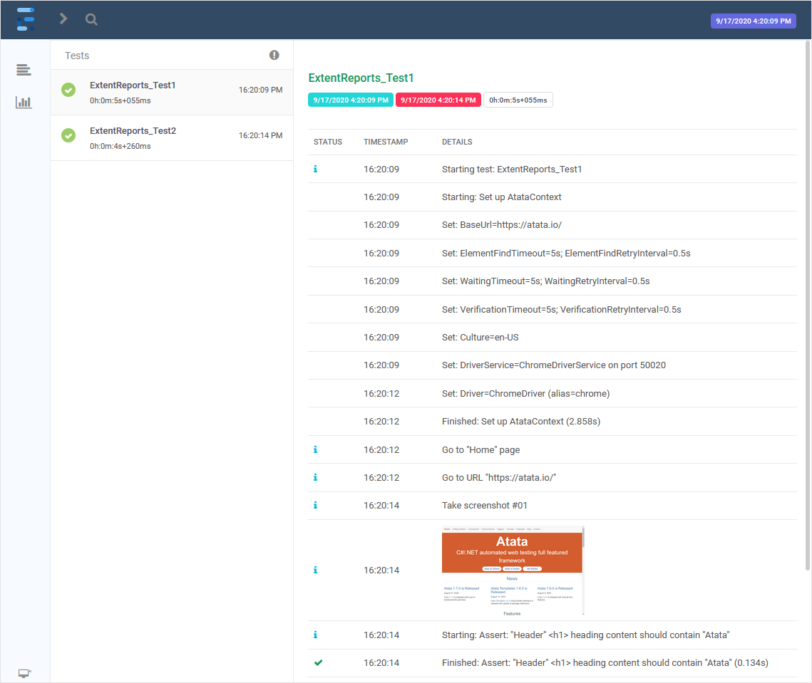

# [Atata Samples](https://github.com/atata-framework/atata-samples) / Extent Reports

[](https://github.com/atata-framework/atata-samples/raw/master/_archives/ExtentReports.zip)

Demonstrates the Atata reporting into [Extent Reports](https://extentreports.com/).

*[Download sources](https://github.com/atata-framework/atata-samples/raw/master/_archives/ExtentReports.zip), run tests, check results and experiment with [Atata Framework](https://atata.io).*

## Implementation

The functionality for Extent Reports is implemented in 3 files:

- [`ExtentContext.cs`](AtataSamples.ExtentReports/Infrastructure/ExtentContext.cs) - the main static class responsible for the initialization of Extent Reports.
  In this sample it attaches HTML reporter (`ExtentHtmlReporter`).
  Other Extent reporters can also be attached.
  Contains `WorkingFolder` property which targets the output folder path, which is by default `Path.Combine(AppDomain.CurrentDomain.BaseDirectory, "Report")`.
- [`ExtentLogConsumer.cs`](AtataSamples.ExtentReports/Infrastructure/ExtentLogConsumer.cs) - is responsible for the reporting of log messages.
  Also does formatting of message.
- [`ExtentScreenshotConsumer.cs`](AtataSamples.ExtentReports/Infrastructure/ExtentScreenshotConsumer.cs) - is responsible for the screenshot saving and adding them to report.

You can copy these files to your project and modify according to your project's needs.

## Configuration

In order to connect Extent Reports to Atata add `ExtentLogConsumer` and `ExtentScreenshotConsumer` to `AtataContextBuilder`.

*Configuraton defined in [`SetUpFixture.cs`](AtataSamples.ExtentReports/SetUpFixture.cs):*

```cs
AtataContext.GlobalConfiguration
    .UseChrome()
        .WithArguments("window-size=1024,768")
        .WithLocalDriverPath()
    .UseBaseUrl("https://atata.io/")
    .UseCulture("en-US")
    .UseAllNUnitFeatures()
    // Extent Reports specific configuration:
    .AddLogConsumer(new ExtentLogConsumer())
    .AddScreenshotConsumer(new ExtentScreenshotConsumer());
```

## Results

After the tests run, the generated Extent HTML report can be found by relative path: `\AtataSamples.ExtentReports\bin\Debug\netcoreapp2.1\Report\index.html`.
All screenshot files are stored in the same folder as `index.html` file.

